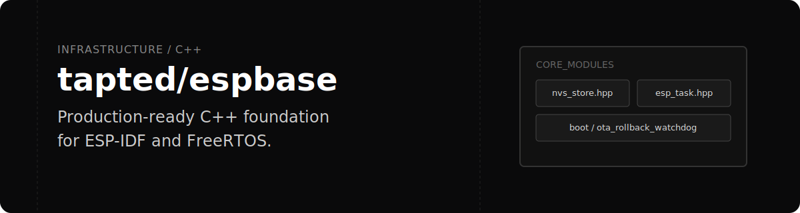

<p align="center">
  
</p>

Provides a structured, production-ready C++ environment for ESP-IDF. `tapted/espbase` wraps FreeRTOS primitives and essential ESP32 subsystems with strict RAII semantics, protecting remote deployments through safe boot mechanisms and crash-loop prevention.

## Mechanism

The framework abstracts low-level ESP-IDF C APIs into object-oriented C++ patterns, preventing memory leaks and dangling hardware states. It focuses heavily on execution stability, utilizing delayed power management and rollback watchdogs to ensure the device remains accessible on the network even after a faulty update.

## Core Modules

| Module | Description | Location |
| :--- | :--- | :--- |
| **Boot** | Boot protection including crash loop detection (`check_crash_loop.cpp`) and OTA rollback watchdogs (`ota_rollback_watchdog.cpp`). | `src/espbase/boot/` |
| **Buffers** | Memory-safe ring buffers for telemetry and state tracking (`circular_history_buffer.cpp`). | `src/espbase/` |
| **JSON** | Native JSON parsing utilities (`json.h`). | `src/espbase/` |
| **Memory** | Memory management and allocation targeted at pseudo-static RAM (`psram_allocator.h`). | `src/espbase/` |
| **NVS** | RAII-compliant Non-Volatile Storage wrappers for flash persistence (`nvs_store.cpp`). | `src/espbase/` |
| **Tasks** | Object-oriented FreeRTOS task management and yielding execution (`esp_task.cpp`, `yielding_task.hpp`). | `src/espbase/` |
| **Types** | Safety wrappers for handling native ESP-IDF `esp_err_t` responses (`esp_result.hpp`). | `src/espbase/` |

## Installation

Add the repository as an ESP-IDF component in your `CMakeLists.txt`:

```cmake
idf_component_register(
    SRCS "main.cpp"
    INCLUDE_DIRS "."
    REQUIRES espbase
)